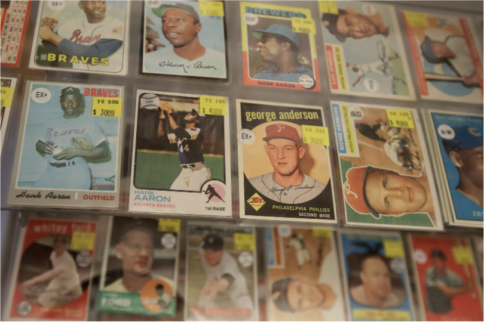

## Columbia University COMSE6998: Cloud Computing & Big Data

  <h1> Mint Condition </h1>

DEMO: [YouTube Link](https://www.youtube.com/watch?v=_2eDtLokbs0)

APP: [Amplify App](https://main.d30hfqistnhxap.amplifyapp.com/) (Sagemaker/ML model deployment has been shut-down)

Project Report: [PDF Link](https://github.com/COMSE6998-013-mint-condition/mint-condition/blob/main/COMSE6998%20Mint%20Condition%20-%20%20Final%20Paper%20.pdf)

The market for sports memorabilia, especially the sale of trading cards, has been growing every year with an estimated market value of over $5 billion. This year alone, eBay has reported that more trading cards have been sold in the first six-months than in all of 2020; an estimated total of $2 billion in gross merchandise revenue. The prices of individual trading cards have also sky-rocketed, with baseball player Honus Wagner’s trading card being sold at $6.6 million in September, 2021. This presents a valuable opportunity for us to tap into the market. 

The value of a card depends highly on its condition, yet existing ways to grade the condition of a card are not effective for most transactions. Amateurs are highly inaccurate at grading cards themselves, and expert annotations are too costly and time-intensive for the vast majority of transactions. The result is that millions of trading cards are simply sold as ungraded. 

To address this problem, we built a web application that automatically grades trading cards from a picture using machine learning. Sourcing the dataset and working off of [Mint Condition](https://github.com/rthorst/mint_condition), a machine learning model that has trained a Convolutional Neural Network (ResNet-18) from scratch, we predict the labels that experts have assigned to training cards. The model was trained on a dataset that has been professionally-graded on eBay, classifying the cards in 10 categories: Gem-mint, Mint, Near-mint-to-mint, Near-mint,  Excellent-to-mint, Excellent, Very-good-to-excellent, Very-good, Good and Fair-to-poor. In addition, we believe a unique feature of our application is that we use the trading card’s metadata and classification to retrieve an estimate for market value from eBay. 

Our models have proven that training the model from scratch performs better than simply fine-tuning the top layer of a pretrained network, perhaps because low-level visual features such as scratches, printing defects, and rounded corners are very important for grading trading cards.

**Backend Team**
Adam Carpentieri, Bharathi Saravanabhavan, Gursifath Bhasin, Taku Takamatsu

**Frontend Team**
I Hun Chan, Jason William Don

**ML Team**
Anirudh Birla, Charles Chen, Maxime Faucher, Pin-Chun Chen, Kushagra Jain
